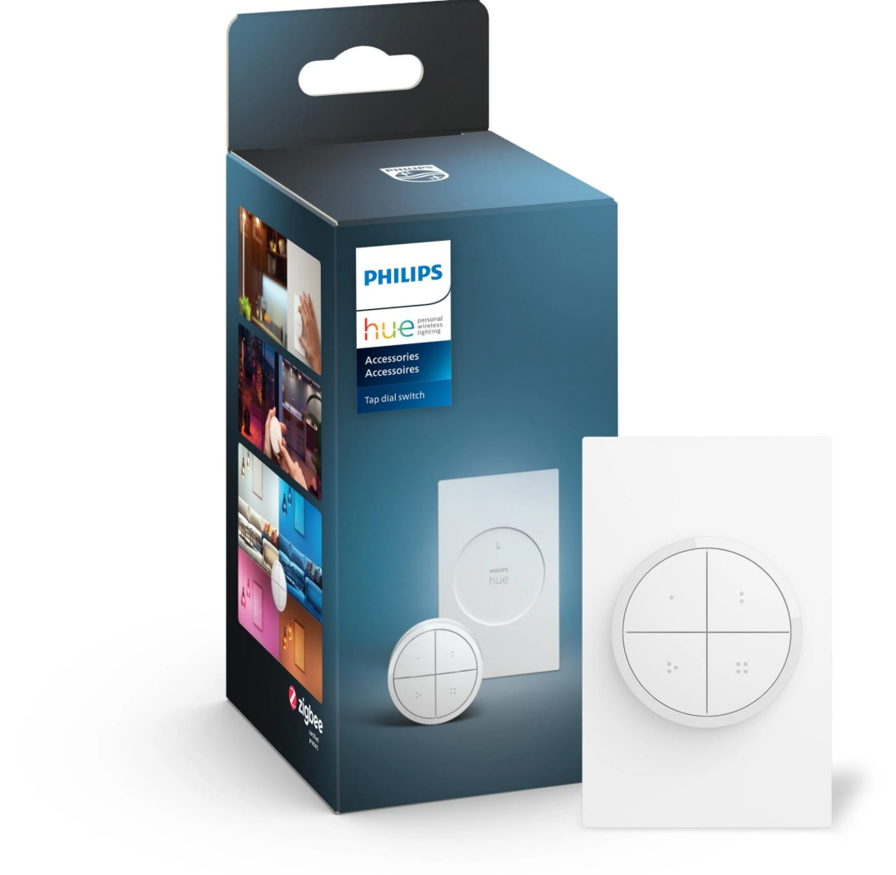

# 🕹️ Smooth Hue Dimming With the Philips Hue Tap Dial (Home Assistant ZHA)

This project turns a Philips Hue Tap Dial with rotary encoder into a **native Home Assistant dimmer system** — including:

✅ Smooth, granular brightness control  
✅ Per-room light selection (double-tap buttons)  
✅ Toggle lights (single-tap buttons)  
✅ Recalls last brightness when turning lights back on  
✅ Works entirely **locally** no cloud, no Hue hub required  
✅ Better logic than Philips Hue’s own ecosystem 😉  

Built for **Zigbee (ZHA)** + **Home Assistant**, using a **Philips Hue Tap Dial** encoder.  

---
> Works with this device 👇

**Philips Hue Tap Dial Switch**  
(Zigbee / 4 buttons + rotary dial)

> Aka: Hue Tap Dial / Hue Dial Switch / Rotary Dimmer (naming varies by region)

---
## 🏗 System Overview

This setup uses **5 automations** and **3 helpers**:

### Helpers
| Name | Type | Purpose |
|------|------|--------|
| `input_text.dial_light_target` | Input Text | Stores selected light |
| `input_number.dial_brightness_buffer` | Input Number (0–255) | Smooth brightness buffer |
| `input_boolean.dial_waiting_capture` | Input Boolean | Captures first brightness value on switch |

### Automations
| Automation | Role |
|-----------|------|
| Toggle Lights | Single-tap toggles light |
| Select Light Target For Dimming Control| Double-tap chooses light |
| Capture Starting Brightness | Catches brightness when rotating dial |
| Brightness Adjustment | Smoothly ramps buffer value |
| Apply Brightness | Sends brightness to lights smoothly |

---

## 🚧 Setup Guide

### 1) Create Helpers
Navigate to:  
**Settings → Devices & Services → Helpers → Create Helper**

You'll create:

| Helper Type | Name | Settings |
|------------|------|---------|
| Input Text | `dial_light_target` | Leave default |
| Input Number | `dial_brightness_buffer` | Min `0`, Max `255`, Step `1`, Slider |
| Input Boolean | `dial_waiting_capture` | Default `off` |

---

### 2) Add Automations

Each automation lives under:  
**`automations/`** folder in this repo.

Create a new automation for each of the examples shown then Copy-paste one by one into Home Assistant

### 3) Bind Buttons to Your Lights

Inside each automation:

Replace `light.living_room_ceiling_lights` etc with your light entities.
And replace any of the tap dial button device ID's with the ID's that correspond with _**your**_ own Philips Hue Tap buttons and dial functions. e.g Button 1 device ID = `xxxyyyyzzzaaabbbcccdddeee`

If you're unsure of how to find the device ID's for your buttons or dial, the simplest and most efficient way to find them all and note them down can be to just create a dummy automation and in the UI editor select the trigger of the automation to be "Device", then find your tap dial device and use the trigger "when button 1 → pressed" from your tap dial. 

Then duplicate the trigger and change it to "button 2" repeat until you have all the buttons in the dummy automation as a trigger. Then also add a device trigger for the "dim up" and another for "dim down" functions of your tap dial. Once all of those are in your dummy automation go to "Edit in yaml" mode and then make note of the device ID numbers that corespond each of the buttons/dimmer functions.

There are plenty of other ways to find these these ID's this is just a shortcut and efficient way to get them all showing in one spot without having to tab in and out of a million places in HA. If you go with this dummy route idea just be sure to note these somewhere before you delete the dummy automation, you won't use that automation for anything so there's no need to save it.

> Future TODO: Create other similar automations that can conrol audio devices or covers/blinds

---

## ✅ Supported Hardware

| Hardware | Status |
|--------|--------|
ZHA w/ Zigbee Radio | ✅ Required 
Philips Hue Tap Dial Zigbee | ✅ Required  
Philips Hue Lights (Zigbee local) | ✅ Perfect compatibility  
Tuya LED strip | ✅ Tested and working using Local Tuya integration

## ❓ Why isn't this a Blueprint?

Short answer: Blueprints can't easily handle this level of interaction.

This setup uses:
- Cross-automation signaling
- A brightness buffer
- A capture state logic flag
- Per-event initial condition handling
- Race-condition prevention

Trying to cram it into one Blueprint would make it **more fragile**, and harder to troubleshoot not easier.

This repo keeps it:
✅ robust  
✅ transparent  
✅ fork-friendly  
✅ mod-friendly  

Blueprint later? Maybe; if I (or one of you amazing geniuses) can figure out a way to bring them all together cohesively in a way I've not considered without them needing more troubleshooting than it's worth.
